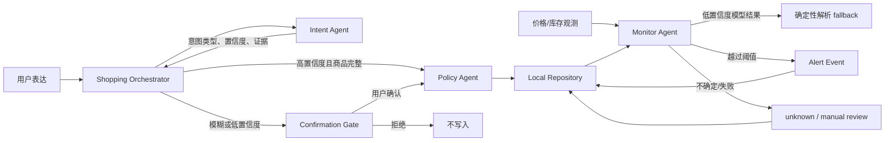

# Local Multi-Agent MVP

> 这是确定性规则基线。当前的三 LLM Agent 架构、豆包 Ark 接入与演示方法见
> [`multiagent-doubao.md`](multiagent-doubao.md)。规则基线仍作为置信度门禁和故障降级层使用。

这一阶段只验证 Agent 决策闭环。Chrome Extension、Supabase 和 Vercel 暂不接入；所有状态由
`JsonRepository` 存到本地 JSON，之后替换 repository adapter 即可迁移到 Supabase。

## Agent topology



只有 Orchestrator 能产生写入副作用。其余 Agent 返回候选判断，不直接修改心愿单，避免多个 Agent
各自“顺手保存”造成不可追溯状态。

## Intent routing contract

意图和商品识别是两个独立置信度：

| 条件 | 路由 |
|---|---|
| 明确购买意图 `>= 0.80`，商品识别 `>= 0.75`，名称和 URL 完整 | 自动入库 |
| 模糊兴趣，不论商品识别多高 | 反问确认 |
| 明确意图但商品缺失或识别置信度不足 | 补充信息并确认 |
| 否定、取消表达 | 忽略，不写入 |

用户确认只表示“允许保存”，不表示可以保存残缺实体。确认后如果仍缺少商品名称或 URL，流程会继续
停留在确认节点。

## Deterministic monitoring policy

| 场景 | 检查频率 |
|---|---:|
| 明确要求补货提醒，或当前无货 | 6 小时 |
| 用户提供目标价 | 24 小时 |
| 用户未提供目标价 | 72 小时 |

- 用户给出目标价时严格使用用户阈值。
- 未给目标价时使用“相对首次价格下降 10%”的显式默认规则，并在 `policy.source` 标出来源。
- 价格提醒只在 `上次价格 > 阈值` 且 `本次价格 <= 阈值` 时触发。
- 补货提醒只在 `out_of_stock -> in_stock` 时触发。
- 第一次观测已经低于阈值时不补发历史提醒。
- Alert 使用 dedupe key，重复状态不会重复生成事件。

## Failure degradation

1. 模型观测置信度低于 `0.75`，或没有证据：优先采用 JSON-LD 等确定性观测。
2. 确定性观测也不可用：状态记为 `unknown`，不更新旧价格、不提醒。
3. 首次失败在不晚于 6 小时后重试；第二次开始退避。
4. 连续三次失败进入 `manual_review`，至少 24 小时后再检查，等待未来 UI 暴露人工处理入口。

所有意图分类、确认、写入和监控判断都会追加到 `audit_log`。

## Run locally

完整演示：

```bash
python3 -m shopping_agent demo
```

运行测试：

```bash
python3 -m unittest discover -s tests -v
```

持久化一条明确意图：

```bash
python3 -m shopping_agent say \
  "帮我盯一下，降到 650 提醒我" \
  --product "羊毛混纺短外套" \
  --url "https://shop.example.com/wool-jacket" \
  --price 799 \
  --stock in_stock \
  --product-confidence 0.94
```

查看心愿单和完整审计记录：

```bash
python3 -m shopping_agent list
python3 -m shopping_agent state
```

CLI 的 JSON 输出就是未来 Extension、Supabase Function 或 Vercel Job 可以消费的消息契约。
`ShoppingRepository` Protocol 是数据访问端口；未来实现 `SupabaseRepository` 时不需要修改任何
Agent 决策逻辑。
