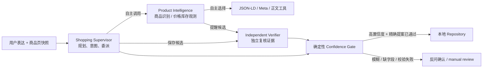

# Doubao Three-Agent MVP

当前阶段只实现可本地演示的 Agent 核心，不部署 Chrome Extension、Supabase 或 Vercel。
模型通过火山方舟 Ark Responses API 调用，状态暂存本地 JSON；后续只需替换输入与 repository
adapter，不需要改 Agent 决策协议。

## 架构



三个 LLM Agent：

1. **Shopping Supervisor（Lite）**：理解用户表达，形成最短计划，自主决定是否调用意图规则、
   商品 Agent、校验 Agent 或查重工具；它没有写入工具。
2. **Product Intelligence（Lite）**：在首次收藏时识别商品，在定时检查时复用同一个 Agent 观察
   当前价格和库存；优先 JSON-LD，其次 meta，最后才读有限正文。
3. **Independent Verifier（Pro）**：不采信其他 Agent 自报的置信度，读取证据板和硬约束，独立
   决定 `approve / ask_user / reject`。

Policy、Trigger、Confidence Gate 和 Repository 都是确定性模块，不占用 LLM 调用。它们分别负责
监控频率、阈值跃迁、最终副作用授权和持久化。

这不是固定自动化工作流：真实运行时，由模型逐轮决定是否调用以及调用哪个只读工具；Product
Agent 和 Verifier 是可独立运行的专门 Agent；Supervisor 可以根据工具结果修正计划。与此同时，
副作用仍由代码门禁控制，避免“自主”变成不可审计。

## 两条核心链路

### 用户表达

1. Supervisor 获得用户原话、已有商品上下文和页面地址。
2. 它可以调用 `rule_intent_analysis` 获得确定性意图基线。
3. 商品信息不足时，它调用 Product Agent；Product Agent 自选页面工具并把证据写入共享 Evidence Board。
4. 只有准备推荐 `auto_save` 时才调用 Verifier。
5. 应用层重新计算意图与商品置信度，确认 Verifier 校验的是**最终那一份精确提案**，再决定写入或反问。

自动保存必须同时满足：

- 明确购买意图 `>= 0.80`；
- 商品名称和 URL 完整，商品置信度 `>= 0.75`；
- 有页面证据或可信的 content-script 商品上下文；
- Supervisor 推荐 `auto_save`；
- Independent Verifier 对完全相同的提案返回 `approve`。

任一条件不满足都不会静默写入。Supervisor 在校验后改价格、目标价、URL 等关键字段时，系统会
用最终提案再次调用 Verifier。

### 价格与库存监控

1. Product Agent 以 `observe` 模式重读页面，并可读取上一次状态。
2. 确定性 Trigger Engine 判断是否第一次越过目标价或发生 `out_of_stock -> in_stock`。
3. 没有触发条件时直接接受新观测，不浪费 Verifier 调用。
4. 有潜在提醒时，Verifier 独立复核证据与候选提醒；通过后才更新状态并生成 alert。
5. Product Agent 低置信度时退回 JSON-LD；解析失败不覆盖旧数据。Verifier 超时或非法输出时进入
   `manual_review`，不发送提醒。

## 本地运行

要求 Python 3.11+，当前实现只使用标准库，无需 `pip install`。

### 1. 无密钥多 Agent 演示

```bash
python3 -m shopping_agent multi-demo
```

这会使用 `ScriptedProvider` 走一遍与真实 API 相同的循环：Supervisor 选择规则工具，委派 Product
Agent；Product Agent 调用 JSON-LD 工具；Supervisor 再委派 Verifier；最后由确定性门禁写入一次。
输出中的 `agent_invocations`、`agent_trace` 和 `evidence_board` 可用于录屏讲解。

### 2. 配置真实豆包模型

先在火山方舟控制台撤销任何曾经发到聊天、终端日志或截图里的密钥，然后创建新密钥。不要把真实
密钥提交到 Git。

```bash
cp .env.example .env
```

编辑 `.env`：

```dotenv
ARK_API_KEY=replace_with_a_new_key
DOUBAO_SUPERVISOR_MODEL=doubao-seed-2-0-lite-260215
DOUBAO_PRODUCT_MODEL=doubao-seed-2-0-lite-260215
DOUBAO_VERIFIER_MODEL=doubao-seed-2-0-pro-260215
```

也可以把模型值替换为你在 Ark 控制台创建的推理接入点 ID。`.env` 已被 `.gitignore` 忽略，加载器
不会覆盖终端里已有的环境变量，也不会打印密钥。

### 3. 运行真实意图与商品识别

仓库带有一个本地商品页 fixture：

```bash
python3 -m shopping_agent \
  --state data/agent_state.json \
  agent-say "帮我盯一下这件外套，降到650提醒我" \
  --url "https://shop.example.com/wool-jacket" \
  --html-file examples/product-page.html
```

模糊表达可用于演示“反问而不写入”：

```bash
python3 -m shopping_agent agent-say \
  "这件外套有点心动，先看看" \
  --url "https://shop.example.com/wool-jacket" \
  --html-file examples/product-page.html
```

查看本地状态和审计记录：

```bash
python3 -m shopping_agent --state data/agent_state.json list
python3 -m shopping_agent --state data/agent_state.json state
```

真实定时检查入口已经实现；把 `ITEM_ID` 换成 `list` 输出中的 id：

```bash
python3 -m shopping_agent \
  --state data/agent_state.json \
  agent-check ITEM_ID \
  --url "https://shop.example.com/wool-jacket" \
  --html-file examples/product-page-sale.html
```

## 测试

```bash
python3 -m unittest discover -s tests -v
```

当前 34 项测试覆盖：意图分流、确认后写入、去重、监控频率、目标价跃迁、补货跃迁、低置信度
JSON-LD 降级、连续失败升级、真实 Agent 工具循环、Agent 内写工具拦截、三 Agent 委派、模糊兴趣
不调用校验、提醒复核、最终提案被篡改后二次校验、Verifier 故障时阻断提醒。

## 效果评测与 Badcase

运行完整评测：

```bash
python3 -m shopping_agent eval --output eval_results/latest.json
```

只复现不产生模型费用的 v0/v2 确定性指标：

```bash
python3 -m shopping_agent eval --baseline-only --output eval_results/baseline.json
```

固定评测集包括 25 条意图表达、33 个商品页面结构、10 个提醒状态跃迁和 8 个 Verifier 对抗提案。
报告同时输出商品识别准确率、提醒 precision/recall、自动入库误触率、模糊兴趣确认率、无关意图
打扰率、Verifier 错误提案拦截率、平均工具调用、平均 token、重复调查率和停止条件比例。

当前可复现的确定性结果为：商品识别 `25/33 = 75.8%` 提升至 `30/33 = 90.9%`；历史 10 条
badcase 中意图漏召 6 条、实体抽取 4 条，比例为 60% / 40%。三 Agent 指标只有在模型 preflight
通过后才会填入；规则降级结果不会冒充 LLM 效果。

## 代码边界

| 模块 | 职责 |
|---|---|
| `multiagent/provider.py` | Ark Responses API 与可测试 Provider 协议 |
| `multiagent/runtime.py` | 有轮次/工具预算的 observe-plan-tool 循环，只准读工具 |
| `multiagent/agents.py` | 三个 Agent、提示词、工具和委派关系 |
| `multiagent/system.py` | Evidence Board、置信度门禁、精确提案校验、写入与提醒编排 |
| `multiagent/product_tools.py` | 通用 JSON-LD、meta 与可见正文解析 |
| `policy_agent.py` | 6/24/72 小时频率与价格阈值策略 |
| `monitor_agent.py` | 确定性状态跃迁、失败退避与 fallback |
| `storage.py` / `ports.py` | 本地 JSON adapter 与未来 Supabase 端口 |

Chrome content script 以后只需传 `{expression, pageSnapshot}`；popup 只读 repository；Vercel cron
调用 `monitor_item`。因此插件层不会持有模型密钥，Ark 调用最终应迁到服务端 API。

## 官方参考

- [火山方舟 Responses API：Function Calling](https://www.volcengine.com/docs/82379/1958524?lang=zh)
- [火山引擎 AgentKit](https://www.volcengine.com/docs/86681?lang=zh)
- [VeADK Python](https://github.com/volcengine/veadk-python)

当前本地 MVP 直接使用 Ark Responses API，依赖最少、便于本地录屏。进入服务端部署阶段后可以再把
runtime 替换为 VeADK / AgentKit，Agent 输入输出和确定性门禁不需要重写。
